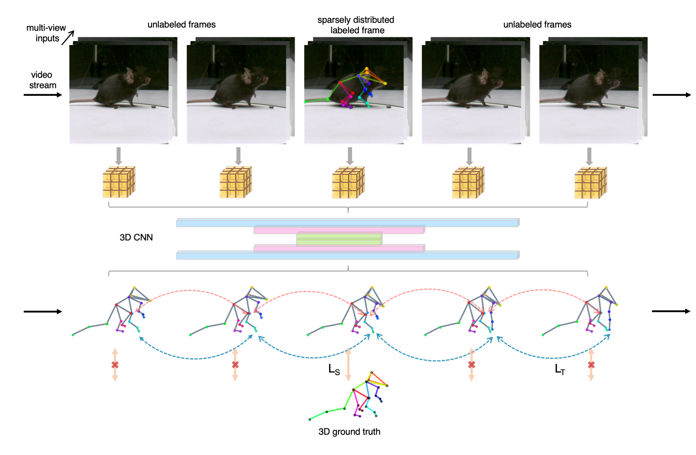

# Documentation for DANNCE Temporal
## Overview
This branch contains the official release for

**Improved Markerless 3D Rodent Pose Estimation Using Temporal Semi-Supervision** Tianqing Li, Kyle S. Severson, Fan Wang and Timothy W. Dunn, 2022.



We have also included custom PyTorch implementations for state-of-the-art animal and human pose estimation approaches:

* DeepLabCut (Mathis et al. 2018)
* Simple Baselines for Human Pose Estimation and Tracking (Xiao et al. 2018)
* Learnable Triangulation of Human Pose (Iskakov et al. 2019)

## Dataset downloads
The public link to access the dataset will be updated soon. For now, please contact tianqing.li@duke.edu if you are interested in using the dataset.


## Basic Usage
To simply apply the 3D temporal constraint to DANNCE

1. Make sure that you have downloaded the datasets and then run `cd markerless_mouse_1`.
2. Run the following commands
```
dannce-train \
your/absolute/path/to/configs_temporal/temporal.yaml \
--dannce-train-dir ./train_dannce_temporal
```
The detailed training configurations can be found in `configs_temporal/temporal.yaml`. 


## Run the comparisons
The non-DANNCE models can be run as follows
```
custom-train \
configs_configurations/dlc.yaml \
--dannce-train-dir ./train_custom
```
where `dlc.yaml` can be replaced by any configuration yaml file within `configs_comparison`.

Notice that `dlc_temporal.yaml` uses a 2D variant of the temporal constraint on top of the DLC architecture. 